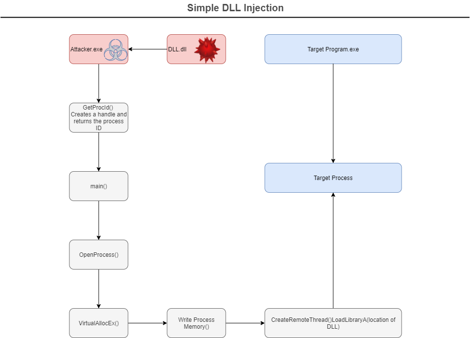

Code Injection in general refers to the act of injecting arbitrary external code in an application.

In code injection, the most general types we have are:

- Injecting into a vulnerable application - An application that have a bug or vulnerability in which a successful exploitation of it will result in injecting malicious code by an attacker.
- Injecting into a non-vulnerable process - An application isn't expected to have a bug, rather we make use of legitimate API functions in windows to inject malicious code or dll's.

In the following injection technique, we'll cover Code Injection via CreateRemoteThread API.

- **CreateRemoteThread**

    CreateRemoteThread is a function provided by WIN32 API for creating threads in another processes. 

    In order to create a thread, we have two conditions that must be met before creating the thread in another application, and they are:

    1. Permissions 

        The process attempting to create a thread (US) in another process must have permissions to create thread. 

        In simpler terms, Integrity levels come into play, the injecting process needs to have the same or higher integrity level thus having sufficient permissions to access the target process.

    2. Session ID 

        Both processes must reside in the same session. If the sessions are not identical the thread will not be created.

- **Algorithm**

